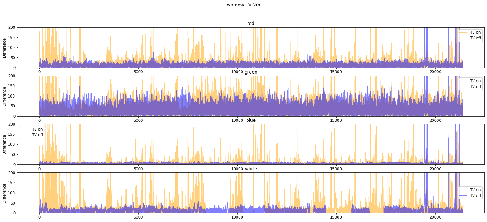
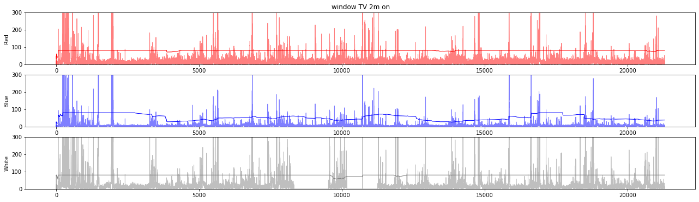
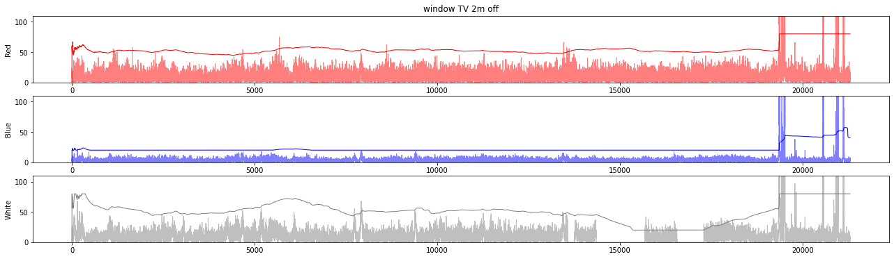
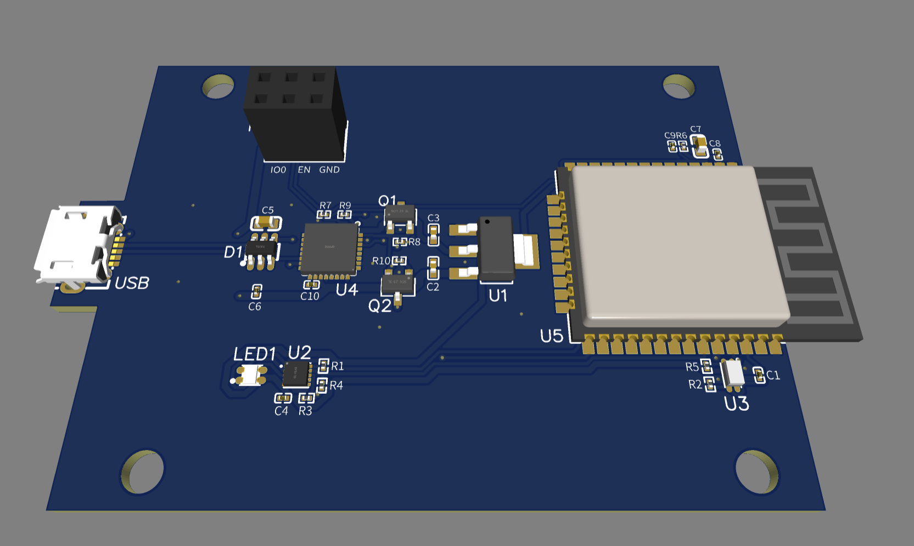
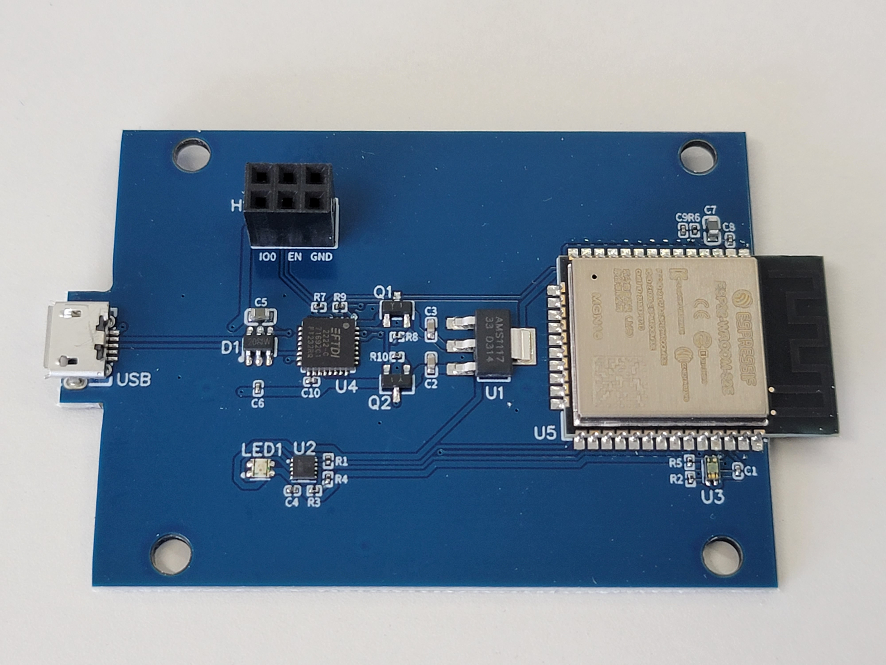
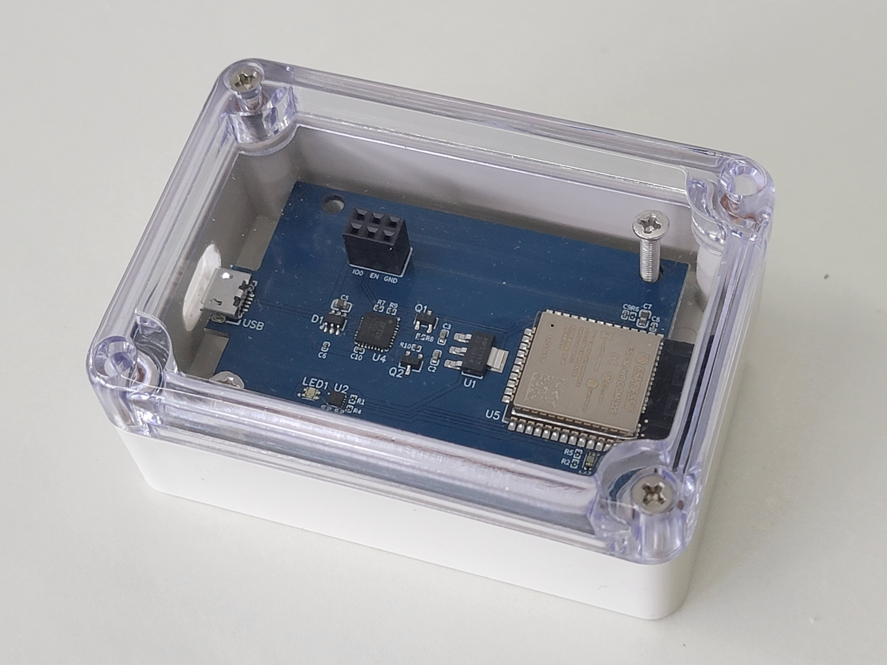

# Descamps Technology Intern Project

## Table of Contents
 - [Overview](#overview)
 - [Methodology](#methodology)
 - [Modes of Operation](#modes-of-operation)
 - [Performance and Limitations](#performance-and-limitations)
 - [Conclusion](#conclusion)
 - [PCB Design](#pcb-design)
 - [Future Work](#future-work)
 - [Acknowledgements](#acknowledgements)

## Overview
The goal of this project is to explore the potential of a single light sensor. The project involve designing a PCB board using EasyEDA Standard edition and integrating the following components:
- [ESP32-WROOM-32E microcontroller](https://www.lcsc.com/product-detail/WiFi-Modules_Espressif-Systems-ESP32-WROOM-32E-N16_C701343.html)
- [VEML6040 light sensor](https://www.lcsc.com/product-detail/Ambient-Light-Sensors_Vishay-Intertech-VEML6040A3OG_C78465.html)
- [WD3153D-10-TR LED driver](https://www.lcsc.com/product-detail/LED-Drivers_WILLSEMI-Will-Semicon-WD3153D-10-TR_C506151.html)
- [LTST-C19HE1WT RGB LED](https://www.lcsc.com/product-detail/Light-Emitting-Diodes-LED_Lite-On-LTST-C19HE1WT_C458749.html)

The light sensor is used to detect changes in ambient light levels in the room, which reflects whether the TV is on or off. The ESP32 microcontroller is used to collect the data from the light sensor and process it, and the LED driver and RGB LED provide visual feedback based on the collected data.

## Methodology
To detect whether the status of the TV, I used changes in light intensity as an indicator. When the TV is on, it emits light that changes rapidly due to the images displayed on the screen. Conversely, when the TV is off, the ambient light level changes slowly due to other factors such as natural light and room lighting.

Below is a graph showing the change in light intensity over time when the TV is on and off. The graph shows that the light intensity changes rapidly when the TV is on, and changes slowly when the TV is off.

    

I used the VEML6040 light sensor to measure the ambient light level in the room. The ESP32-WROOM-32E microcontroller reads the analog voltage output of the light sensor and processes it to determine whether the TV is on or off.

To implement this approach, I use a threshold value to distinguish between the two states. I've adopted a dynamic threshold value that changes based on the average change in light level in the time window. This is to account for the fact that the ambient light level in the room may change over time due to factors such as natural light and room lighting. 

When the measured change in light level exceeds the threshold value a set number of times in a time window, it is assumed that the TV is on. If the TV is on, the LED will light up. Conversely, if the number of changes in light level that exceed the threshold is below the set value, it is assumed that the TV is off, and the LED will be turned off.

The following graphs show the threshold value adjusting to changes in the ambient light level through time. The first graph shows the threshold value when the TV is on, and the second graph shows the threshold value when the TV is off.

    
    

## Modes of Operation
The device operates in two modes: data collection mode and direct processing mode.

### Data Collection Mode
In data collection mode, the device collects data about the ambient light level in the room over a period of time. This data can be used for further analysis and processing, such as identifying patterns in the light levels over time.

Once the device is in data collection mode, it will continuously measure the ambient light level in the room using the VEML6040 light sensor. To ensure thread safety and prevent data corruption, semaphores have been implemented to synchronize the data collection and data retrieval between a double buffer mechanism. Using a python script, the collected data will be stored in the designated file for later analysis. By using the double buffer mechanism and semaphores, the device can acquire and store data in a thread-safe manner, ensuring that the collected data is accurate and reliable for further analysis.

### Direct Processing Mode
In direct processing mode, the device processes the data collected by the light sensor in real-time to determine whether the TV is on or off. 

Once the device is in direct processing mode, it will continuously measure the ambient light level in the room using the VEML6040 light sensor. The ESP32 microcontroller will then process the data in real-time to determine whether the TV is on or off, based on the threshold value discussed earlier. The RGB LED will light up to indicate the state of the TV.

## Performance and Limitations
### Performance
Clean datasets were collected in two environments: TV in a room with windows and TV in a room without windows. In both environments, data were collected from 2 meters, 1 meter, and 30 centimeters away from the TV.

The following table shows the detection accuracy of the device against clean testing datasets in different environments and distances from the TV.

| Environment | Distance | TV State | Accuracy | TV State | Accuracy |
| :---: | :---: | :---: | :---: | :---: | :---: |
| Window | 2m | On | 98.77 | Off | 98.46 |
| Window | 1m | On | 93.35 | Off | 100.00 |
| Window | 30cm | On | 91.80 | Off | 100.00 |
| Room | 2m | On | 91.55 | Off | 100.00 |
| Room | 1m | On | 91.73 | Off | 100.00 |
| Room | 30cm | On | 95.52 | Off | 100.00 |

From the results, we can see that the device is able to detect whether the TV is on or off with decent average accuracy of **96.77%**.

However, the device's accuracy is heavily influenced by the surrounding environment. It is very sensitive to changes in light levels caused by moving objects, such as people walking in front of the sensor. This can result in false positives, which can reduce the device's overall precision.

### Limitations
There are several limitations to the Light Sensor TV On/Off Detector that should be taken into account:

- Sensor placement: The placement of the light sensor can also affect the performance of the device. If the sensor is placed too far away from the TV, it may not be able to detect the light intensity changes caused by the TV.

- Limited capability: The device can only gather information about the ambient light level in the room due to having only one kind of sensor. It will be unable to effectively detect other factors that may affect the TV, such as the presence of people in the room.

## Conclusion
Overall, this project explored the potential of using a single light sensor to detect changes in ambient light levels and determine whether a TV is on or off in a room. While the project has shown a good level of detection accuracy in clean testing datasets, it also highlights the limitations of relying on a single sensor to gather information about the environment. The device is sensitive to changes in light levels caused by moving objects, which can lead to false positives and affect the accuracy of the device.

## PCB Design
<h3 align="center">Schematics</h3>

    

<h3 align="center">PCB Layout</h3>

    
    

## Final Product

    
    

## Future Work
In the future, this project could be expanded to incorporate additional sensors to increase the amount of data gathered and improve accuracy. For example, a motion sensor can distinguish between light changes caused by scene changes on the TV and those caused by moving objects in front of the device. An infrared sensor can help filter out sunlight by comparing it with light sensor readings.

## Acknowledgements
This project was completed as part of an internship program. Thanks to the mentors and colleagues who provided guidance and support throughout the project.